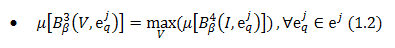
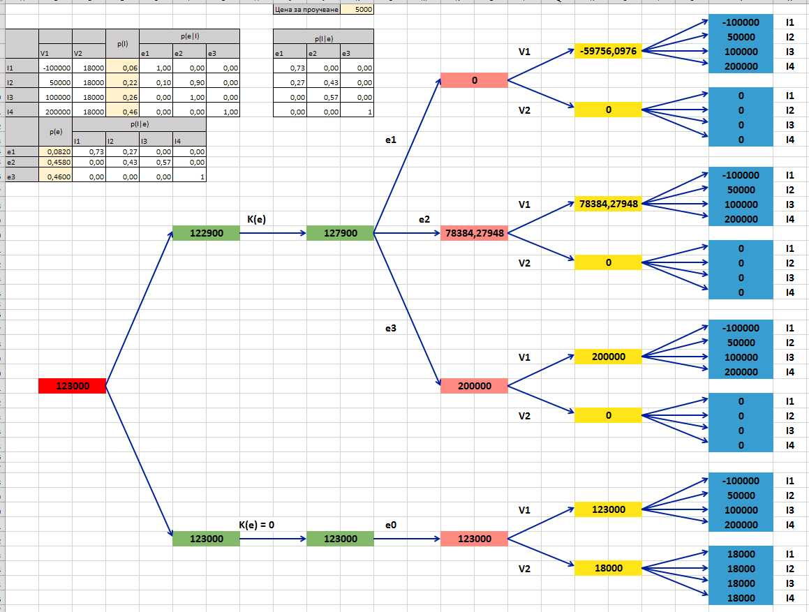

# vba-decision-tree-example
Solution of a decision-making problem in Excel using Visual Basic for Applications


# Курсова работа
## Вземане на решения при риск и неопределеност

### Съдържание

1. [Теоретична част](#теоретична-част)

2. [Решение на задачата](#решение-на-задачата)

3. [Разработен софтуер](#разработен-софтуер)

	1. [Generate Tree](#generate-tree)

	2. [Fill Tree](#fill-tree)

	3. [Trace Path](#trace-path)

	4. [Clear Tree](#clear-tree)

4. [Анализ на резултати и изходи](#анализ-на-резултати-и-изходи)

# Теоретична част

Поставената задача изисква вземане на решение в условия на риск, като се
използва т.нар. дърво на решенията. Това е графичен метод за избор на
алтернатива чрез изследване на последователни и взаимно свързани решения
и резултатите от тях. Дървото на решенията дава възможност за избор на
рационално управленско решение, когато за всяка алтернатива са известни
или могат да бъдат предвидени стойността на възможните резултати и
вероятностите за постигане на даден резултат.

Самото дърво представлява дървовиден граф. Коренът му показва началото
на процеса на вземане на решение (ПВР), а листата сочат резултатите от
реализацията на всяка една от алтернативите. Всеки връх на графа описва
различно решение на лицето взимащо решение (ЛВР) или различна ситуация
от ПВР. Всяко ребро може да отразява реализация на взето решение, поява
на дадено състояние или конкретен резултат от проведения експеримент.

От условието на задачата се извличат следните данни, необходими за
нейното решение:

-   множество на алтернативите 

-   множество на състоянията на околната среда 

-   априорното разпределение на вероятностите *p*(*I*) на състоянията на
    ОС;

-   множество на възможните резултати *B* = {*B*<sub>*s*</sub>} при
    избор на ∀ *V*<sub>*i*</sub> ∈ *V*;

-   множество на всички възможни експерименти
    *е* = (*e*<sup>0</sup>,*e*<sup>1</sup>,…,*e*<sup>*j*</sup>,…,*e*<sup>*M*</sup>)
    и на резултатите от всеки експеримент 

За вземане на решение се използва алгоритъм, състоящ се от следните
стъпки:

1.  Построява се самото дърво на решенията.

2.  На базата на априорните вероятности
    *p*(*e*<sub>*q*</sub>\|*I*<sub>*l*</sub>) се определят условните
    апостериорни вероятности *p*(*I*<sub>*l*</sub>\|*e*<sub>*q*</sub>).
    За целта се използва формулата на Бейс
    ,
    където *p*(*e*<sub>*q*</sub>) (пълната вероятност за дадения
    резултат от
    експеримента)

3.  За всеки резултат *B*<sub>*s*</sub> ∈ *B* се определя количествена
    оценка *μ*\[*B*<sub>*s*</sub>\], като тя зависи от избраната
    алтернатива, появилото се състояние на ОС и получения резултат на
    избрания експеримент.

4.  За всеки връх на дървото в обратен ред се определят съответните
    оценки, като се използват следните формули:

    

    Формула 1.1 се прилага за съседните на листата върхове, като кои
    вероятности ще се използват зависи от това в коя част на дървото е
    разположен съответния връх (кой резултат от експеримента се е случил).
    В разклонението, отговарящо на случая, при който не се прави
    експеримент, се използват априорните вероятности *p*(*I*) на
    състоянията на ОС.

    

    Формула 1.2 се прилага за всички върхове, достигнати след получаването
    на даден резултат от експеримента (включително *ε*<sub>0</sub> – не се
    провежда експеримент). След тях предстои избор на алтернатива. Избира
    се тази, при която оценката е най-висока.

    

    Формула 1.3 се използва за върха на предходното ниво, отговарящ на
    взетото решение да се направи експеримент. Тук се използват пълните
    вероятности за всеки резултат. Процедурата при другия връх на това
    ниво (този, при който е взето решение да не се прави експеримент) се
    състои в пренасяне на стойността от предходния етап.

5.  От получената стойност се изважда цената на експеримента *K*(*e*).
    Стойността от върха, отговарящ на *ε*<sub>0</sub>, се преписва без
    промяна.

6.  В корена на дървото се записва по-голямата от последно получените
    стойности. Нейното местоположение дава отговор на въпроса дали е
    по-добре да се прави експеримент или не.

7.  Дървото се проследява в посоката на неговото построяване, като се
    определя коя е най-добрата алтернатива при всяко състояние на ОС.

# Решение на задачата

На база на предоставената в условието информация се извличат следните
данни:


, където:

-   *V*1 – Използване на концесията

-   *V*2 – Продажба на концесията

-   *I*1 – Отсъствие на ресурси

-   *I*2 – Наличие на само един ресурс от вид 1

-   *I*3 – Наличие на два ресурса

-   *I*4 – Наличие на само един ресурс от вид 2

-   *е*1, *e*2, *e*3 – Трите възможни типа (I, II, III) на проучвания
    район (резултати от експеримента)

-   *p*(*I*) – Вероятностите за попадане в съответното състояние на
    околната среда

-   *p*(*e*\|*I*) – Априорните вероятности даденият резултат от
    експеримента да се получи при съответното състояние на ОС.

Цената за продажба на концесията е постоянна и се изчислява по формулата
15000 + 1000 \* *K*, където K – последната цифра от фак. № на студента.
В случая *K* = 3 → 15000 + 1000 \* 3 = 15000 + 3000 = 18000.

<u>Забележка</u>: По условие, ако бъде направен експеримент и се вземе
решение концесията да не се използва, то тя няма да може да бъде
продадена за 18000. Това условие трябва да бъде отразено в дървото, като
листата от клона, съответстващ на провеждането на теста, отговарящи на
алтернативата V2 (Продажба на концесията), ще имат стойност 0 вместо
18000.

Печалбите при алтернатива V1 – (Използване на концесията) са дадени
директно, като в зависимост от състоянието на ОС те са следните:

-   I1 – Отсъствие на ресурси:  − 100 000

-   I2 – Наличие на само един ресурс от вид 1: 50 000

-   I3 – Наличие на два ресурса: 100 000

-   I4 – Наличие на само един ресурс от вид 2: 200 000

Вероятностите за отделните състояния също се изчисляват с помощта на
*K* = 3:

-   I1 – Отсъствие на ресурси: 

-   I2 – Наличие на само един ресурс от вид 1: 

-   I3 – Наличие на два ресурса: 

-   I4 – Наличие на само един ресурс от вид 2: 

Вероятностите *p*(*e*\|*I*) се извличат от следната таблица:


Получава се:

*p*(*e*1\|*I*1) = 4/4  = 1   *p*(*e*1\|*I*2) = 1/10 = 0.1  *p*(*e*1\|*I*3)  = 0/6 = 0  *p*(*e*1\|*I*4) = 0/5 = 0

*p*(*e*2\|*I*1) = 0/4  = 0   *p*(*e*2\|*I*2) = 9/10 = 0.9  *p*(*e*2\|*I*3)  = 6/6 = 1  *p*(*e*2\|*I*4) = 0/5 = 0

*p*(*e*3\|*I*1) = 0/4  = 0   *p*(*e*3\|*I*2) = 0/10 = 0     *p*(*e*3\|*I*3)   = 0/6 = 0  *p*(*e*3\|*I*4) = 5/5 = 1

Пълните вероятности *p*(*e*) също могат да бъдат изчислени:

*p*(*e*1) = *p*(*e*1\|*I*1)*p*(*I*1) + *p*(*e*1\|*I*2)*p*(*I*2) + *p*(*e*1\|*I*3)*p*(*I*3) + *p*(*e*1\|*I*4)*p*(*I*4) = 0.082

*p*(*e*2) = *p*(*e*2\|*I*1)*p*(*I*1) + *p*(*e*2\|*I*2)*p*(*I*2) + *p*(*e*2\|*I*3)*p*(*I*3) + *p*(*e*2\|*I*4)*p*(*I*4) = 0.458

*p*(*e*3) = *p*(*e*3\|*I*1)*p*(*I*1) + *p*(*e*3\|*I*2)*p*(*I*2) + *p*(*e*3\|*I*3)*p*(*I*3) + *p*(*e*4\|*I*4)*p*(*I*4) = 0.460

На базата на тези вероятности определяме апостериорните вероятности
*p*(*I*\|*e*) – вероятността да се е сбъднало даденото условие на ОС при
получаването на съответния резултат от експеримента.

Резултатите са:


След като всички необходими данни са намерени, се преминава към
построяването на самото дърво (от корена към листата) и негово попълване
(от листата към корена). На база на получените стойности се определя
дали е целесъобразно да се прави експеримент, както и коя би била
най-добрата алтернатива при всеки един резултат от него.

Използваните формули са адаптирани към възможностите на продукта
Microsoft Excel и биват следните:

-   SUMPRODUCT (във всеки жълто оцветен възел) между оценките при
    съответния резултат и стратегия (оцветени със синьо) и
    апостериорните вероятности на различните състояния при този резултат
    (от таблицата).

-   MAX (във всеки розово оцветен възел) измежду стойностите на
    произлизащите от него жълти възли.

-   SUMPRODUCT (в зеления възел, от който произлизат трите резултата от
    експеримента (розовите възли)) между самите тях и пълните
    вероятности за тяхното осъществяване (налични в таблицата – също
    изчислени чрез SUMPRODUCT).

-   MAX (в червения корен) между очакваните резултати съответно при
    извършването/неизвършването на експеримент (произлизащите от корена
    зелени възли).





# Разработен софтуер

Визуализацията на дървото на решенията на конкретната задача е
реализирана чрез Microsoft Excel. При стартиране на файла се прави
почистване на съдържанието и форматирането на клетките, в които се
разполага дървото. Премахват се всички форми. Колоните и редовете се
привеждат в стандартните им размери. По този начин дори при запазване на
файла с вече генерирано дърво, при следващото стартиране то ще бъде
премахнато и той ще бъде готов за последващо ползване. Самата таблица с
данните остава непроменена. Тези операции се изпълняват със следния код:

```vba
Private Sub Workbook_Open()
  'Clear cell content and formating
  Range("A19:AC100").Clear
  Range("A19:AC100").ClearFormats
  Range("L1:AC18").Clear
  Range("L1:AC18").ClearFormats

  'Remove all previous shapes
  Dim Shp As Shape
  For Each Shp In ActiveSheet.Shapes
    If Shp.Type = msoAutoShape Then Shp.Delete
  Next Shp

  'Reset row height and column width
  Rows.UseStandardHeight = True
  Columns.UseStandardWidth = True
End Sub
```

За осъществяването на визуализацията са налични четири бутона:


## Generate Tree

С този бутон се постига визуалното оформление на дървото. В началото
отново се извърша почистване на предишните промени.

```vba
Private Sub BtnGenerate_Clear()
  'Clear cell content and formating
  Range("A19:AC100").Clear
  Range("A19:AC100").ClearFormats
  Range("L1:AC18").Clear
  Range("L1:AC18").ClearFormats

  'Remove all previous shapes
  Dim Shp As Shape
  For Each Shp In ActiveSheet.Shapes
    If Shp.Type = msoAutoShape Then Shp.Delete
  Next Shp

  'Reset row height and column width
  Rows.UseStandardHeight = True
  Columns.UseStandardWidth = True
```

След това се преминава към обхождане на необходимите клетки и тяхното
форматиране. За тази цел клетките са предварително определени и
именувани по подходящ начин. Първо се открива и форматира клетката, в
която е разположен коренът на дървото.

```vba
For Each nm In ThisWorkbook.Names
    If Left(nm.Name, 5) <> "start" Then GoTo Skip1
    With Range(nm)
        .Merge
        .HorizontalAlignment = xlCenter
        .VerticalAlignment = xlCenter
        .Font.Size = 16
        .Font.Bold = True
        .Interior.Color = RGB(255, 0, 0)
    End With
        
Skip1:
Next nm
```

Същата процедура се прави и за останалите нива.

```vba
For Each nm In ThisWorkbook.Names
    If (Right(nm.Name, 5) <> "Label1" Then GoTo Skip10
    With Range(nm)
        .HorizontalAlignment = xlCenter
        .VerticalAlignment = xlCenter
        .Font.Size = 16
        .Font.Bold = True
    End With
    
Skip10:
Next nm
```

Форматиране се прилага и върху клетките, съдържащи пояснителните надписи
върху дървото.

За генериране на стрелките, свързващи отделните върхове, се използва
следната функция:

```vba
Private Sub DrawArrow(FromRange As Range, ToRange As Range)

    ' Getting range coords and dimensions
    Dim dleft1 As Double, dleft2 As Double
    Dim dtop1 As Double, dtop2 As Double
    Dim dheight1 As Double, dheight2 As Double
    Dim dwidth1 As Double, dwidth2 As Double
    dleft1 = FromRange.Left
    dleft2 = ToRange.Left
    dtop1 = FromRange.Top
    dtop2 = ToRange.Top
    dheight1 = FromRange.Height
    dheight2 = ToRange.Height
    dwidth1 = FromRange.Width
    dwidth2 = ToRange.Width
     
' Generating the arrow from the right center point of the first cell to the left center point of the second cell
    ActiveSheet.Shapes.AddConnector(msoConnectorStraight, dleft1 + dwidth1, dtop1 + dheight1 / 2, dleft2, dtop2 + dheight2 / 2).Select
    
    ' Arrow formating
    With Selection.ShapeRange.Line
        .BeginArrowheadStyle = msoArrowheadNone
        .EndArrowheadStyle = msoArrowheadOpen
        .Weight = 1.75
        .Transparency = 0
        .ForeColor.RGB = RGB(0, 31, 156)
    End With
 
End Sub
```

Тя се вика за всяка стрелка

```vba
    .................................................
    Call DrawArrow(Range("exper1"), Range("alter11"))
    Call DrawArrow(Range("exper1"), Range("alter12"))
    
    Call DrawArrow(Range("exper2"), Range("alter21"))
    Call DrawArrow(Range("exper2"), Range("alter22"))
    
    Call DrawArrow(Range("exper3"), Range("alter31"))
    Call DrawArrow(Range("exper3"), Range("alter32"))
    
    Call DrawArrow(Range("exper0"), Range("alter01"))
    Call DrawArrow(Range("exper0"), Range("alter02"))
    .................................................
```

На някои места в кода се поставя изкуствено забавяне с цел по-добро
визуално представяне.

```vba
    Application.Wait Now + #12:00:01 AM# '1 sec delay
```

## Fill Tree

Бутон Fill Tree се грижи за самото попълване на дървото с данни.
Използват се референции към клетките от таблица, като така има
възможност за промяна на отделните стойности.

```vba
Private Sub FillTree()
       
    For Each nm In ThisWorkbook.Names
    If (Left(nm.Name, 4) <> "sast") Then GoTo Skip9
        With Range(nm)
            .Cells(2).Value = "I" + Right(nm.Name, 1)
            .Cells(2).HorizontalAlignment = xlCenter
        End With

    Skip9:
    Next nm

    Dim i As Integer
    i = 8
    
    For Each nm In ThisWorkbook.Names
        If (Left(nm.Name, 4) <> "sast" Or 
            Mid(nm.Name, 6, 1) <> 1) Then GoTo Skip6
            
        Range(nm).Cells(1).Formula = "=B" + CStr(i)
        If i = 11 Then i = 8 Else i = i + 1
            
    Skip6:
    Next nm
    
    For Each nm In ThisWorkbook.Names
        If (Left(nm.Name, 4) <> "sast" Or 
            Mid(nm.Name, 6, 1) <> 2 Or 
            Mid(nm.Name, 5, 1) <> 0) Then GoTo Skip7
            
        Range(nm).Cells(1).Formula = "=C" + CStr(i)
        If i = 11 Then i = 8 Else i = i + 1
        
    Skip7:
    Next nm
    
    For Each nm In ThisWorkbook.Names
        If (Left(nm.Name, 4) <> "sast" Or 
            Mid(nm.Name, 6, 1) <> 2 Or 
            Mid(nm.Name, 5, 1) = 0) Then GoTo Skip8
            
        Range(nm).Cells(1).Value = "0"
        
    Skip8:
    Next nm
```

В нужните клетки се поставят необходимите формули.

```vba
Range("alter11").Formula = "=SUMPRODUCT(" + Range("e1_").Address + "," + Range("groupSast11").Address + ")"
Range("alter12").Formula = "=SUMPRODUCT(" + Range("e1_").Address + "," + Range("groupSast12").Address + ")"
Range("alter21").Formula = "=SUMPRODUCT(" + Range("e2_").Address + "," + Range("groupSast21").Address + ")"
Range("alter22").Formula = "=SUMPRODUCT(" + Range("e2_").Address + "," + Range("groupSast22").Address + ")"
Range("alter31").Formula = "=SUMPRODUCT(" + Range("e3_").Address + "," + Range("groupSast31").Address + ")"
Range("alter32").Formula = "=SUMPRODUCT(" + Range("e3_").Address + "," + Range("groupSast32").Address + ")"
Range("alter01").Formula = "=SUMPRODUCT(" + Range("pi_").Address + "," + Range("groupSast01").Address + ")"
Range("alter02").Formula = "=SUMPRODUCT(" + Range("pi_").Address + "," + Range("groupSast02").Address + ")"

Range("exper1").Formula = "=MAX(" + Range("alter11").Address + "," + Range("alter12").Address + ")"
Range("exper2").Formula = "=MAX(" + Range("alter21").Address + "," + Range("alter22").Address + ")"
Range("exper3").Formula = "=MAX(" + Range("alter31").Address + "," + Range("alter32").Address + ")"
Range("exper0").Formula = "=MAX(" + Range("alter01").Address + "," + Range("alter02").Address + ")"

Range("noExp2").Value = "=" + Range("exper0").Cells(1).Address
Range("noExp").Value = "=" + Range("noExp2").Cells(1).Address

Range("yesExp2").Formula = "=" + Range("pe_").Cells(1).Address + "*" + Range("exper1").Cells(1).Address + "+" + Range("pe_").Cells(2).Address + "*" + Range("exper2").Cells(1).Address + "+" + Range("pe_").Cells(3).Address + "*" + Range("exper3").Cells(1).Address

Range("yesExp").Formula = "=" + Range("yesExp2").Cells(1).Address + "-" + Range("K4").Address

Range("start").Formula = "=MAX(" + Range("yesExp").Cells(1).Address + "," + Range("noExp").Cells(1).Address + ")"
```

Методът завършва с попълването на надписите.

```vba
    Range("keLabel").Value = "K(e)"
    Range("ke0Label").Value = "K(e) = 0"
    Range("e1Label").Value = "e1"
    Range("e2Label").Value = "e2"
    Range("e3Label").Value = "e3"
    Range("e0Label").Value = "e0"
    Range("v11Label").Value = "V1"
    Range("v21Label").Value = "V2"
    Range("v12Label").Value = "V1"
    Range("v22Label").Value = "V2"
    Range("v13Label").Value = "V1"
    Range("v23Label").Value = "V2"
    Range("v10Label").Value = "V1"
    Range("v20Label").Value = "V2"
       
End Sub
```

## Trace Path

Методът, който се стартира при натискането на този бутон определя дали е
целесъобразно да се направи експериментът, както и коя е най-добрата
алтернатива при отделните резултати от него. Върху всеки път, получен
след направен избор на ЛВР, се поставя един от два възможни символа.


В началото се премахват всички предишни символи.

```vba
Private Sub btnTracePath_Click()
    
    'Remove all previous shapes
    Dim Shp As Shape
    For Each Shp In ActiveSheet.Shapes
        If Shp.AutoShapeType = msoShapeNoSymbol Or 
           Shp.AutoShapeType = msoShapeChevron Then
            Shp.Delete
        End If
    Next Shp
```

Дефинират се и се инициализират променливи за местата, на които се
поставят символите.

```vba
Dim yesExp As Range, 
    noExp As Range, 
    alter11 As Range, 
    alter12 As Range, 
    alter21 As Range, 
    alter22 As Range, 
    alter31 As Range, 
    alter32 As Range, 
    alter01 As Range, 
    alter02 As Range
    
Set yesExp = Range("D24")
Set noExp = Range("D34")
Set alter11 = Range("Q7")
Set alter12 = Range("Q10")
Set alter21 = Range("Q18")
Set alter22 = Range("Q21")
Set alter31 = Range("Q29")
Set alter32 = Range("Q32")
Set alter01 = Range("Q40")
Set alter02 = Range("Q43")
```

За всяко място се сравняват съответните стойности. Резултатът от
сравнението определя кой символ кое място да заеме.

```vba
If Range("yesExp").Cells(1).Value = Range("start").Cells(1).Value Then
  Shapes.AddShape msoShapeNoSymbol, noExp.Left, noExp.Top, Application.CentimetersToPoints(2.87), Application.CentimetersToPoints(2.61)

  Shapes.AddShape msoShapeChevron, yesExp.Left, yesExp.Top, Application.CentimetersToPoints(2.57), Application.CentimetersToPoints(2.73)
Else
  Shapes.AddShape msoShapeNoSymbol, yesExp.Left, yesExp.Top, Application.CentimetersToPoints(2.87), Application.CentimetersToPoints(2.61)

  Shapes.AddShape msoShapeChevron, noExp.Left, noExp.Top, Application.CentimetersToPoints(2.57), Application.CentimetersToPoints(2.73)
End If

If Range("alter11").Cells(1).Value = Range("exper1").Cells(1).Value Then
  Shapes.AddShape msoShapeNoSymbol, alter12.Left, alter12.Top, Application.CentimetersToPoints(1.32), Application.CentimetersToPoints(1.21)

  Shapes.AddShape msoShapeChevron, alter11.Left, alter11.Top, Application.CentimetersToPoints(1.23), Application.CentimetersToPoints(1.28)
Else
  Shapes.AddShape msoShapeNoSymbol, alter11.Left, alter11.Top, Application.CentimetersToPoints(1.32), Application.CentimetersToPoints(1.21)

  Shapes.AddShape msoShapeChevron, alter12.Left, alter12.Top, Application.CentimetersToPoints(1.23), Application.CentimetersToPoints(1.28)
End If
```

Накрая се извърша форматиране на символите, за да изглеждат по начина
представен по-горе.

```vba
    Dim ShpNo As Shape
    For Each ShpNo In ActiveSheet.Shapes
        If ShpNo.AutoShapeType = msoShapeNoSymbol Then
            ShpNo.Fill.ForeColor.RGB = RGB(252, 3, 3)
        End If
    Next ShpNo
    
    Dim ShpYes As Shape
    For Each ShpYes In ActiveSheet.Shapes
        If ShpYes.AutoShapeType = msoShapeChevron Then
            ShpYes.Rotation = 90
            ShpYes.Adjustments.Item(1) = 0.6
            ShpYes.Fill.ForeColor.RGB = RGB(24, 105, 63)
        End If
    Next ShpYes
    
End Sub
```

## Clear Tree

Бутонът Clear Tree връща работното поле в началния му вид.

```vba
Private Sub btnClear_Click()
    'Clear cell content and formating
    Range("A19:AC100").Clear
    Range("A19:AC100").ClearFormats
    Range("L1:AC18").Clear
    Range("L1:AC18").ClearFormats
    
    'Remove all previous shapes
    Dim Shp As Shape
    For Each Shp In ActiveSheet.Shapes
        If Shp.Type = msoAutoShape Then Shp.Delete
    Next Shp
    
    'Reset row height and column width
    Rows.UseStandardHeight = True
    Columns.UseStandardWidth = True
End Sub
```

# Анализ на резултати и изходи

Както става ясно от представените по-горе изображения, при така
зададените данни по-добрият вариант е да не бъде правен експеримент
(123 000 &gt; 122 900). Тогава трябва да се избере алтернатива *V*1
(използване на концесията), тъй като 123 000 &gt; 18 000.

Ако все пак бъде направен експеримент, най-добрите избори биха били
следните:

-   В случай че районът е от тип *I* (*e*1) – избира се алтернатива *V*2
    (продажба на концесията), тъй като  − 59 756, 1 &lt; 0. Този
    резултат не е изненада, като се има предвид фактът, че по условие в
    4/5 от районите от този тип отсъстват каквито и да е ресурси.

-   Ако районът е от тип II (*e*2) – избира се алтернатива *V*1
    (ползване на концесията), тъй като 78 384, 3 &gt; 0. Тук отново
    логиката е видна - по условие в 9/15 от районите от този тип са
    налични ресурси от вид 1, а в 6/15 – и от двата вида, т.е. в този
    случай няма райони, в които да не се срещат никакви ресурси.

-   При третата възможност – район от тип III (*e*3) – също се избира
    алтернатива *V*1 (ползване на концесията), защото 200 000 &gt; 0.
    Тук разликата между двете алтернативи е още по-голяма, тъй като във
    всеки район от този тип е наличен само ресурс от вид 2, а
    вероятността за появата на това състояния на ОС е най-голяма – 0,46.
